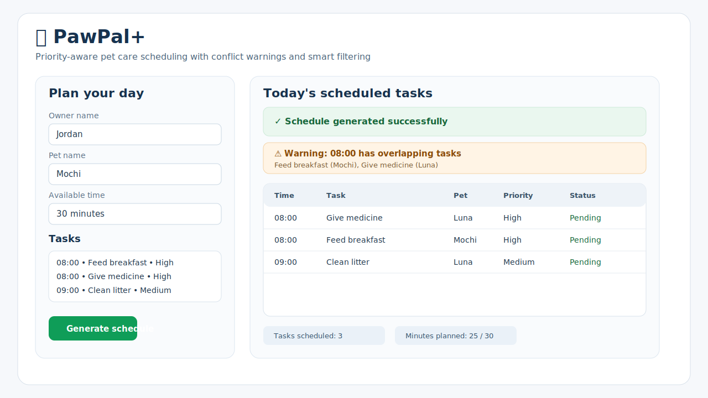

# 🐾 PawPal+

PawPal+ is a Streamlit scheduling app that helps a pet owner organize feeding, walks, medicine, grooming, and other care tasks into a clear daily plan.

It combines task priority, available time, time-based ordering, and conflict warnings to build a practical schedule for the day.

---

## 📸 Demo



The app dashboard lets you add tasks, generate a schedule, review warnings, and see sorted or filtered task views in one place.

---

## ✨ Features

PawPal+ includes the following scheduling features from the codebase:

- **Priority-aware planning**: chooses the highest-value tasks first when time is limited.
- **Sorting by time**: uses `sort_by_time()` to order `HH:MM` tasks chronologically.
- **Conflict warnings**: uses `detect_time_conflicts()` to warn when two tasks share the same time slot.
- **Task filtering**: uses `filter_tasks()` to show tasks by pet name or completion status.
- **Daily and weekly recurrence**: completed recurring tasks automatically create the next occurrence.
- **Pending task tracking**: shows tasks that did not fit into the current schedule.
- **Professional Streamlit display**: uses tables, status messages, and warning banners for a cleaner user experience.

---

## 🧠 How the Scheduler Works

1. Collect all tasks for the owner’s pet(s).
2. Score tasks by priority and available time.
3. Select the best combination of tasks that fits the daily time budget.
4. Sort scheduled tasks by their `HH:MM` time when provided.
5. Warn about overlapping tasks instead of crashing the app.
6. Recreate the next daily or weekly task when a recurring task is marked complete.

---

## 🚀 Getting Started

### 1. Set up the environment

```bash
python -m venv .venv
.venv\Scripts\activate   # Windows
pip install -r requirements.txt
```

### 2. Run the Streamlit app

```bash
streamlit run app.py
```

### 3. Run the terminal demo

```bash
python main.py
```

### 4. Run the tests

```bash
python -m pytest
```

---

## 🖥️ Using the App

1. Enter the owner and pet information.
2. Add tasks with a duration, priority, and optional time.
3. Click **Generate schedule**.
4. Review:
   - the scheduled task table,
   - any conflict warnings,
   - pending tasks that did not fit,
   - sorted and filtered task views.

---

## 📁 Project Structure

- `app.py` – Streamlit interface
- `main.py` – terminal demo for sorting, filtering, and conflict warnings
- `pawpal_system.py` – core classes and scheduling algorithms
- `tests/test_pawpal.py` – automated tests for scheduling behavior
- `reflection.md` – project reflection and UML notes

---

## ✅ Current Status

The project includes tested logic for:

- task organization by priority,
- time-based sorting,
- filtering by pet and completion,
- recurring daily/weekly tasks,
- lightweight schedule conflict warnings.


