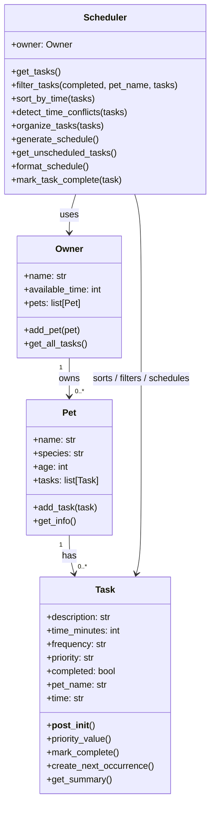

# PawPal+ Project Reflection

## 1. System Design

**a. Initial design**

- Briefly describe your initial UML design.
separating data models from the scheduling logic. I included a Pet class to store information about the pet, an Owner class to represent the user’s availability and preferences, and a Task class for care activities like feeding, walking, and medication with details such as duration and priority. I also designed a Scheduler class to decide which tasks should be included in the daily plan and in what order. Finally, I planned for a Schedule or DailyPlan class to hold the completed plan. I assigned each class a clear responsibility so the system would be easier to organize, test, and improve later.

- What classes did you include, and what responsibilities did you assign to each?

**b. Design changes**

- Did your design change during implementation?
Yes  I did
- If yes, describe at least one change and why you made it.
To make my structure solid, , i realized #Task is not clearly tied to # Pet. I added a pet_name field to Task

---

## 2. Scheduling Logic and Tradeoffs

**a. Constraints and priorities**

- What constraints does your scheduler consider (for example: time, priority, preferences)?
- How did you decide which constraints mattered most?

**b. Tradeoffs**

- Describe one tradeoff your scheduler makes.
- Why is that tradeoff reasonable for this scenario?
essential tasks happen first
---

## 3. AI Collaboration

**a. How you used AI**

- How did you use AI tools during this project (for example: design brainstorming, debugging, refactoring)?
- What kinds of prompts or questions were most helpful?

**b. Judgment and verification**

- Describe one moment where you did not accept an AI suggestion as-is.
- How did you evaluate or verify what the AI suggested?

---

## 4. Testing and Verification

**a. What you tested**

- What behaviors did you test?
- Why were these tests important?

**b. Confidence**

- How confident are you that your scheduler works correctly?
- What edge cases would you test next if you had more time?

---

## 5. Reflection

**a. What went well**

- What part of this project are you most satisfied with?

**b. What you would improve**

- If you had another iteration, what would you improve or redesign?

**c. Key takeaway**

- What is one important thing you learned about designing systems or working with AI on this project?

## UML 

